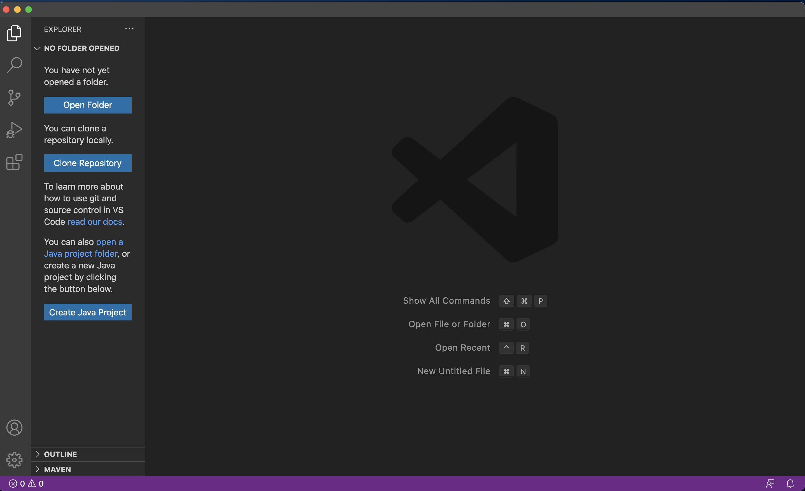
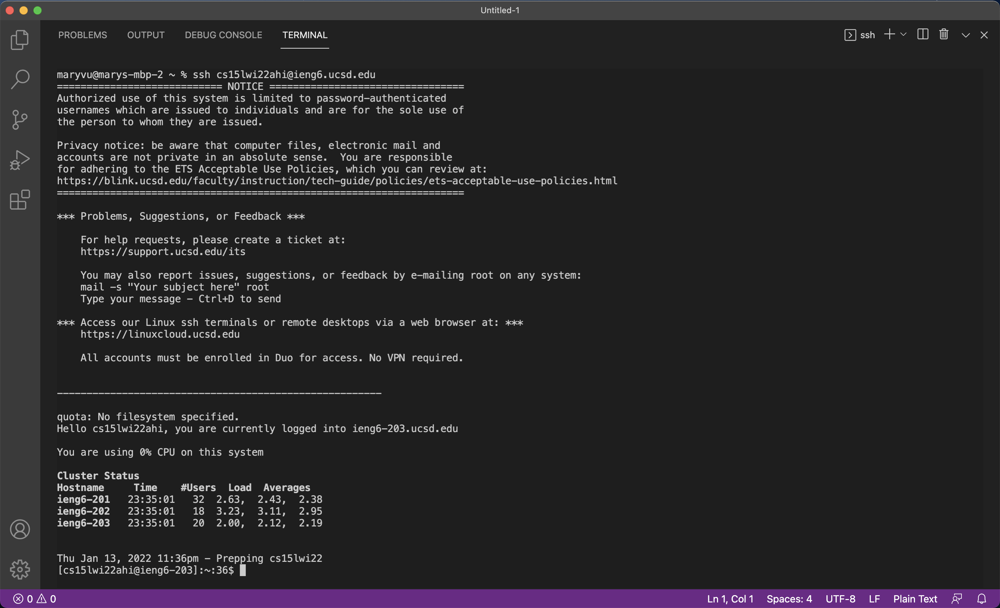

# Remote Access and the File System Tutorial

## 1. Installing VS Code
Download Visual Studio Code [here](https://code.visualstudio.com/) and follow the instructions to install it onto your computer. Once you've finished and opened it, the window should look something like this:

## 2. Remotely Connecting
First, open a terminal in VS Code (Control + \` or use the Terminal → New Terminal menu option). Then, type the following command but replace the `zz` with the letters in your course-specific account.

`$ ssh cs15lwi22zz@ieng6.ucsd.edu`

If it's your first time connecting to the server, it may prompt you with a question. In that case, type `yes`.

Once you've entered your password and logged on, your terminal should look something like this: 

Congrats! You're terminal is now connected to a computer in the CSE basement, and the commands you run now will run on that computer. 

> Note: the your computer is called the *client* and the computer that you are connected to (in the basement) is called the *server*.

