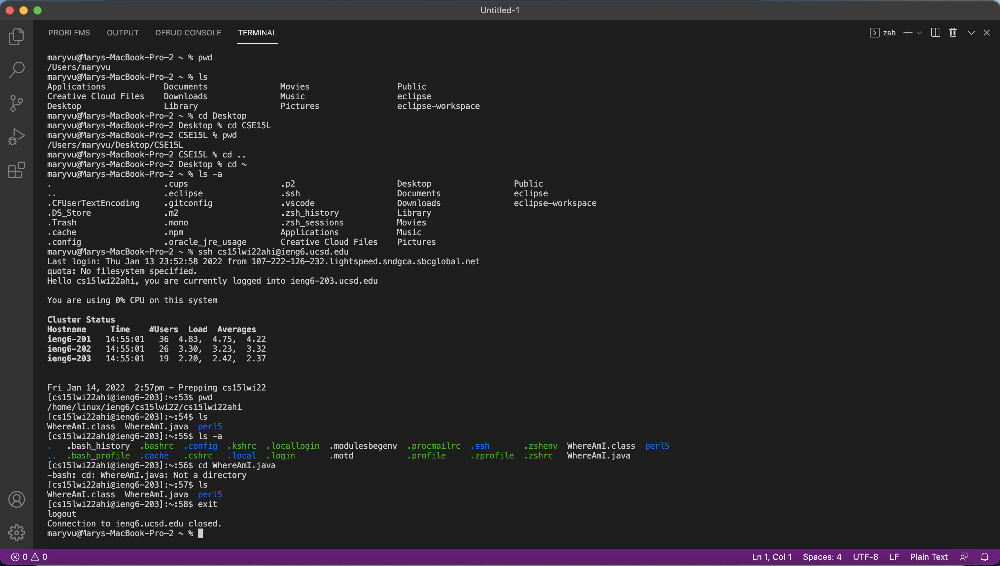
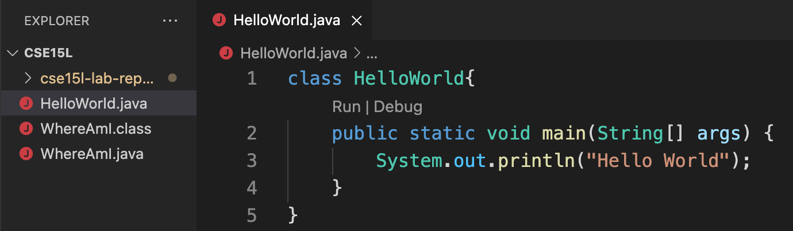
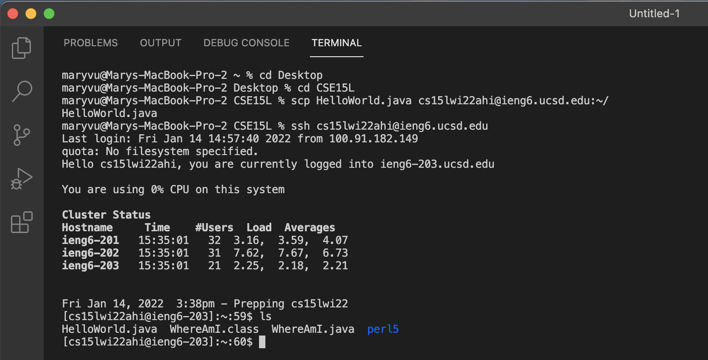

# Remote Access and the File System Tutorial

## 1. Installing VS Code
Download Visual Studio Code [here](https://code.visualstudio.com/) and follow the instructions to install it onto your computer. Once you've finished and opened it, the window should look something like this:

## 2. Remotely Connecting
First, open a terminal in VS Code (Control + \` or use the Terminal → New Terminal menu option). Then, type the following command but replace the `zz` with the letters in your course-specific account.

> `$ ssh cs15lwi22zz@ieng6.ucsd.edu`

If it's your first time connecting to the server, it may prompt you with a question. In that case, type `yes`.

Once you've entered your password and logged on, your terminal should look something like this: 

Congrats! You're terminal is now connected to a computer in the CSE basement, and the commands you run now will run on that computer. 

> Note: the your computer is called the *client* and the computer that you are connected to (in the basement) is called the *server*.

## 3. Trying Some Commands
Some of the basic commands:

* `pwd` - print working directory
* `ls` - list files in current directory
* `cd` - change directory 
* `cd ..` - change to parent directory of current directory
* `cp` - copy files or group of files or directory
* `cd ~` - returns you to your user account's home folder.
* `ls -a` - list all files in current directory including hidden files
* `exit` - log out of the remote server in your terminal

Try running some of these commands on your computer, and on the remote computer after ssh-ing.

It should look something like this:

## 4. Moving Files with `scp`
We've just learned a lot about local and remote computers, but what's the point of it all? It enables programmers to work for a company or organization from anywhere, hence the phrase *working remotely*. Something key to working remotely is copying files back and forth between the computers.

First, create a file on your computer. In my case, I created a `HelloWorld.java` file in a folder (a.k.a. directory) called CSE15L on my Desktop and put the following code in it:

Now it's time to copy the file from your computer to the remote computer using the `scp` command which stand for *secure copy*.

> Note: Run this command from the *client* (your computer, not logged into `ieng6`)

Then, in the terminal go to the directory where you made your file, and run this command (remember to replace the `zz`):

`scp <your-file-name> cs15lwi22zz@ieng6.ucsd.edu:~/`

Now, to test it, log into ieng6 with `ssh` and run `ls`. If you've done it correctly, you will see the file in your home directory. It should look something like this:

