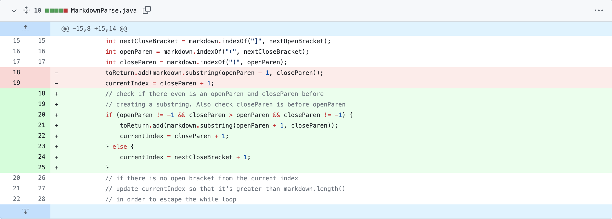

# Incremental Programming and Debugging

## Bug 1

> [failure-inducing input](https://github.com/vumary/markdown-parse-lab-report-2/blob/main/test-file2.md)

The bug was that there was no updating of the currentIndex to make the while-loop condition false if there were characters after the last link. As you can guess, the symptom is shown when the while-loop runs infinitely until you're out of memory. The specific failure-inducing input I used was adding some text after the links in the `.md` file.
## Bug 2

> [failure-inducing input](https://github.com/vumary/markdown-parse-lab-report-2/blob/main/test-file3.md)

The bug was that the program would attempt to create a substring despite the argument being a negative number. As you can guess, the symptom shown was an index out of bounds error. The specific failure inducing output I used was not including any parenthesis at all in the `.md` file.

## Bug 3

> [failure-inducing input](https://github.com/vumary/markdown-parse-lab-report-2/blob/main/test-file7.md)

The bug was that the program would enter an infinite loop even though the `.md` file only has 2 character. The symptom shown was an infinite while-loop. The specific failure inducing output I used was only adding `)[` into the `.md` file.

