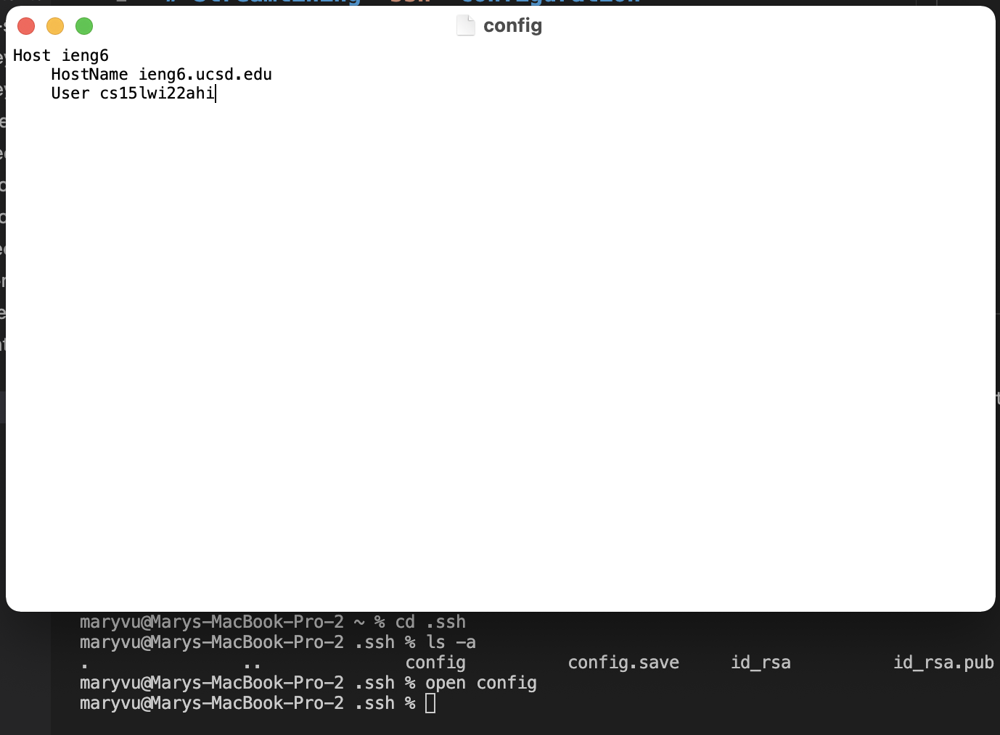
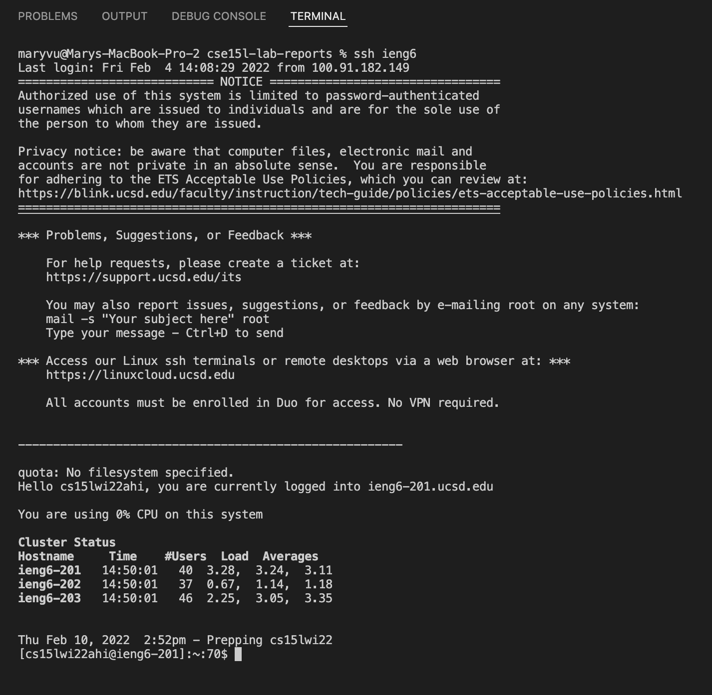
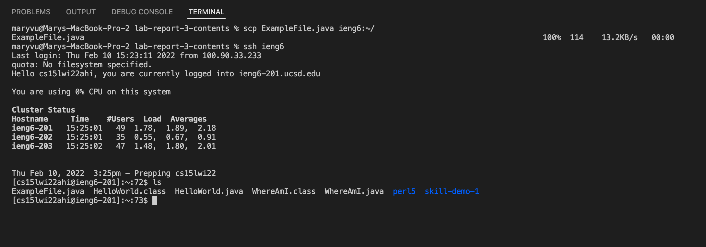

# Streamlining `ssh` Configuration

## `.ssh/config` file, and how I edited it

- To get to this point, I first used the command line to `cd` to the `.ssh` directory and then I used the `touch` command to create the `config` file.
- While still in the `.ssh` directory, I used the `open` command to open and edit the newly created file.
- Lastly, I copy and pasted the code under "Group Choice 1" from the [week 5 lab page](https://ucsd-cse15l-w22.github.io/week/week5/) into this file.

## Showing the `ssh` command logging into my account using the alias I chose.

- As shown at the top of the screenshot, I only had to type `ssh ieng6` to log in. This is a lot faster than what I had to do previously, which was run `ssh cs15lwi22ahi@ieng6.ucsd.edu` and then also type my password.
- Streamlining `ssh`, like so, is extremely useful because it makes working remotely more efficient; it cuts the time spent switching between client and server.

## Showing a `scp` command copying a file to my account using the alias I chose.

- Here, I used my `ieng6` alias instead of typing `cs15lwi22zz@ieng6.ucsd.edu` to run the `scp` command.
- Then, I used the `ls` command to show that `ExampleFile.java` successfully copied over to my account on the server.