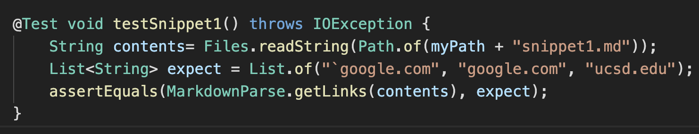
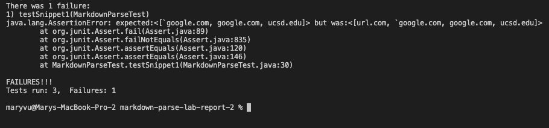
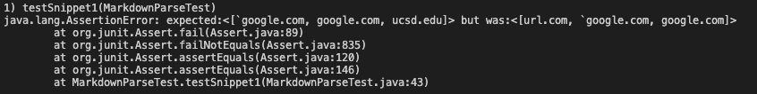
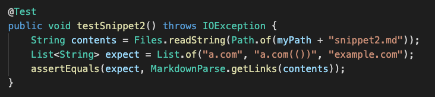
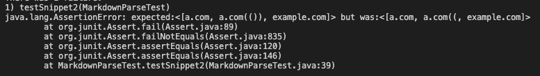
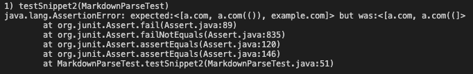
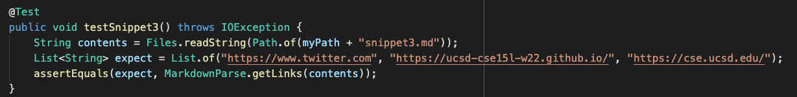
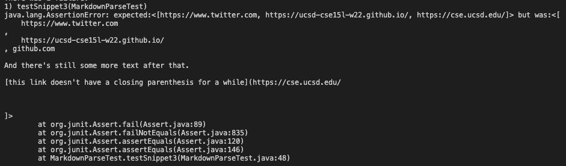
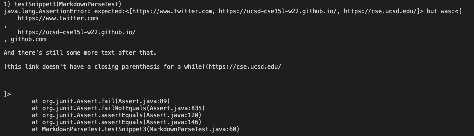

# Repositories:

[My MarkdownParse](https://github.com/vumary/markdown-parse-lab-report-2)

[Peer's MarkdownParse](https://github.com/yi113/markdown-parse)

# Snippet 1
The test should produce the output ``[`google.com, google.com, ucsd.edu]``

## JUnit Test

## Running the Test on my MarkdownParse

## Running the Test on my Peer's MarkdownParse

I don't think there is a small code change that will make my program run for snippet 1 and all related cases that use inline code with backticks. This is because markdown won't detect a link if there is a bracket or parenthesis in between backticks. So, we would have to check for a backtick `` ` ``, then check if there is a open/closing bracket/parenthesis, then check for a closing backtick. This would take more than 10 lines. 

# Snippet 2
The test should produce the output ``[a.com, a.com(()), example.com]``

## JUnit Test

## Running the Test on my MarkdownParse

I do not think there is a small code change that will make my program work for snippet 2 and all related cases that nest parentheses, brackets, and escaped brackets. This is because I would have to count all of the parenthesis and brackets, then apply a complicated logic that determines which ones pair with eachother. Then, I would have to determine which one is the outermost pair of parentheses/brackets to retrieve the valid link. This would take more than 10 lines.

## Running the Test on my Peer's MarkdownParse

# Snippet 3
The test should produce the output ``[https://www.twitter.com, https://ucsd-cse15l-w22.github.io/, https://cse.ucsd.edu/]``

## JUnit Test

## Running the Test on my MarkdownParse

## Running the Test on my Peer's MarkdownParse

I think there is a small code change that will make my program work for snippet 3 and all related cases that have newlines in brackets and parentheses. This is because all I would have to do is implement a helper method that trims the unnecessary newlines by replacing them with empty strings and then the rest of the code would work properly. This would take less than 10 lines.