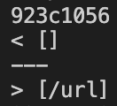
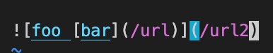
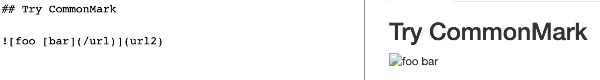
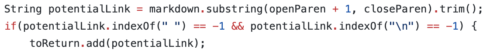
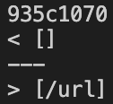
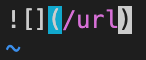
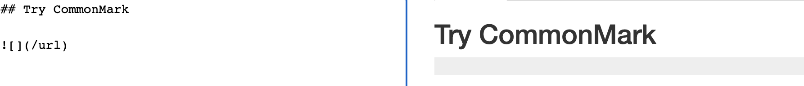

# Finding `diff`erent tests
To find tests with different results, 
- I first set up my repository and the cse15l repository on `ieng6`. 
- Then, I edited each of their `make` files to print the filename as it ran each test. 
- Then, I used the command `bash script.sh > results.txt` on both repositories.
- Finally, I compared the two implementations using the command `diff your-markdown-parse/results.txt cse15l-markdown-parse/results.txt `. 
> Note: I used `vim results.txt` and `:set numbers` to find which test file caused the difference and then used [this](https://spec.commonmark.org/dingus/) website to find the expected CommonMark result. 

# Test File 574
Found using `diff`:

`574.md` contents:

`574.md` expected output: `[]`

My implementation's output: `[]`

CSE15L's implementation's output: `[/url]`

CSE15L's implementation is incorrect. What's wrong with the program is that it doesn't invalidate links that are nested inside images. This is the code that should be fixed:

Inside this if statement it should check if `openParen` and `closeParen` are both **not** between the parentheses of an image.   
> Note: you would have to implement code which checks if there is an image by looking for this syntax `` and then it should store the indexes of `[` and `]` so that it can be used in the if statement.

# Test File 580

Found using `diff`:

`580.md` contents:

`580.md` expected output: `[]`

My implementation's output: `[]`

CSE15L's implementation's output: `[/url]`

CSE15L's implementation is incorrect. What's wrong with the program is that it doesn't check if there is nothing in the brackets. If there is nothing in the brackets then the link should automatically be invalidated because CommonMark will have no text to associate the link with, therefore it won't appear. This is the code that should be fixed:

Inside this if statement it should check if `nextOpenBracket` and `nextCloseBracket` are **not** consective before adding the `potentialLink` into `toReturn`.

